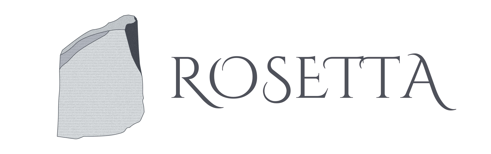

<div align="center">
  
</div>

<div align="center">
  <a href="https://npmjs.org/package/rosetta">
    
  </a>
  <a href="https://github.com/lukeed/rosetta/actions">
    
  </a>
  <a href="https://codecov.io/gh/lukeed/rosetta">
    
  </a>
</div>

<div align="center">A general purpose internationalization library in 298 bytes!</div>

## Features

* Simple and Familiar API
* Unobstrusive and Unopinionated
* Less than 300 bytes – including dependencies!


## Install

```
$ npm install --save rosetta
```


## Usage

```js
import rosetta from 'rosetta';

const i18n = rosetta({
  en: {
    intro: {
      welcome: 'Welcome, {{username}}!',
      text: 'I hope you find this useful.',
    },
    support(obj) {
      let hour = Math.floor(Math.random() * 3) + 9;
      let str = `For questions, I'm available on ${obj.date.toLocaleDateString()}`;
      str += `, any time after ${hour}:00.`
      return str;
    }
  }
});

// set default language
i18n.locale('en');

// add new language
i18n.set('pt', {
  intro: {
    welcome: obj => `Benvind${obj.feminine ? 'a' : 'o'}, ${obj.username}!`,
    text: 'Espero que você ache isso útil.'
  }
});

// append extra key(s) to existing language
i18n.set('pt', {
  support(obj) {
    let hour = Math.floor(Math.random() * 3) + 9;
    let str = `Se tiver perguntas, estou disponível em ${obj.date.toLocaleDateString()}`;
    str += `, qualquer hora depois às ${hour}:00.`
    return str;
  }
});

const data = {
  feminine: false,
  username: 'lukeed',
  date: new Date()
};

// Retrieve translations
// NOTE: Relies on "en" default
i18n.t('intro.welcome', data); //=> 'Welcome, lukeed!'
i18n.t('intro.text', data); //=> 'I hope you find this useful.'
i18n.t('support', data); //=> 'For questions, I'm available on 4/8/2020, any time after 11:00.'

// Retrieve translations w/ lang override
i18n.t('intro.welcome', data, 'pt'); //=> 'Benvindo, lukeed!'

// Change default language key
i18n.locale('pt');

// Retrieve translations w/ new defaults
i18n.t('intro.text', data); //=> 'Espero que você ache isso útil.'
i18n.t('intro.text', data, 'en'); //=> 'I hope you find this useful.'
```


## API

### rosetta(dict?)
Returns: `Rosetta`

Initializes a new `Rosetta` instance.<br>You may optionally provide an initial translation object.

### rosetta.locale(lang?)
Returns: `String`

Sets the language code for the `Rosetta` instance.<br>This will cause all [`rossetta.t()`](#rosettatkey-params-lang) lookups to assume this `lang` code.

The function will return the currently active `lang` code. This means that a setting a new value will reply with the same value. Additionally, calling `locale()` without any argument will return the `lang` code that the `Rosetta` instance was last given.

#### lang
Type: `String`<br>
Required: `false`

The language code to choose.<br>
If `locale()` is called without an argument (or with a falsey value), then the current `lang` code is returned.

### rosetta.set(lang, table)

Merge (or override) translation keys into the `lang` collection.

#### lang
Type: `String`

The language code to target.

#### table
Type: `Object`

A new record of key-values to merge into the `lang`'s dictionary.

Each key within the `table` can correspond to a function or a string template.

When using a function, it will receive the entire data input (see [`params`](#params)).<br>You are required to ensure the function returns a (string) value of your liking.

When using a string template, anything within double curly brackets (`{{ example }}`) will be interpreted as a key path and interpolated via [`templite`](https://github.com/lukeed/templite). The key path can use dot-notation to access nested values from the data input (see [`params`](#params)). Additionally, if a key path did not resolve to a value, an empty string is injected.

```js
const ctx = rosetta({
  en: {
    foo: (obj) => `function sees "${obj.value || '~DEFAULT~'}"`,
    bar: 'template sees "{{value}}"'
  }
});

ctx.t('foo', {}, 'en');
//=> 'function sees "~DEFAULT~"
ctx.t('foo', { value: 123 }, 'en');
//=> 'function sees "123"

ctx.t('bar', {}, 'en');
//=> 'template sees ""
ctx.t('bar', { value: 123 }, 'en');
//=> 'template sees "123"
```

### rosetta.table(lang)
Returns: `Object` or `undefined`

Retrieve the the `lang`'s full dictionary/table of translation keys.

If the language does not exist (aka, no translations have been provided for it), you'll receive `undefined`.<br>Otherwise, you'll receive the full object as it exists within the `Rosetta` instance. See [`table`](#table).

> **Important:** Manipulating this object is any way will mutate and affect your `Rosetta` instance. Be careful!

#### lang
Type: `String`

The language code's table to retrieve.


### rosetta.t(key, params?, lang?)
Returns: `String`

Retrieve the value for a given `key`.

> **Important:** In the normal/default mode, an empty string will be returned for unknown keys.<br>Conversely, in ["debug" mode](#debugging), an error message will be printed and `undefined` will be returned for unknown keys.

#### key
Type: `String` or `Array<String|Number>`

The identifier to retrieve.

A `key` can access nested properties via:

* a string that with dot notation &mdash; `'foo.bar[1].baz'`
* an array of individual key segments &mdash; `['foo', 'bar', 1, 'baz']`

> **Important:** You are expected to know & traverse your own dictionary structure correctly.

```js
const ctx = rosetta({
  en: {
    fruits: {
      apple: 'apple',
    }
  }
});

ctx.locale('en');

ctx.t('fruits.apple'); //=> 'apple'
ctx.t(['fruits', 'apple']); //=> 'apple'
```

### params
Type: `any`<br>
Optional: `true`

The data object argument to pass your dictionary keys' string templates and/or functions.

> **Note:** If your *string template* tries to access a key that doesn't exist, an empty string is injected.

```js
const ctx = rosetta({
  es: {
    hello: '¡Hola {{name}}!'
  },
  en: {
    hello(obj) {
      return obj.name === 'lukeed' ? 'wazzzuppp' : `Hello, ${obj.name}!`;
    },
  },
  pt: {
    hello: 'Oi {{person}}, tudo bem?' // <-- key is wrong
  },
});

const user1 = { name: 'lukeed' };
const user2 = { name: 'Billy' };

ctx.t('hello', user1, 'es'); //=> '¡Hola lukeed!'

ctx.t('hello', user1, 'en'); //=> 'wazzzuppp'
ctx.t('hello', user2, 'en'); //=> 'Hello, Billy!'

ctx.t('hello', user1, 'pt'); //=> 'Oi , tudo bem?'
```

### lang
Type: `String`<br>
Optional: `true`

A language code override without changing the entire `Rosetta` instance's default language.

```js
const ctx = rosetta();

ctx.locale('en'); //=> set default

ctx.t('greeting', 'lukeed');
//=> (en) 'Hello lukeed!'
ctx.t('greeting', 'lukeed', 'es');
//=> (es) '¡Hola lukeed!'
ctx.t('bye');
//=> (en) 'Cya'
```

## Debugging

There is a "debug" mode included for **development** environments.

The **only** difference with "debug" mode is that [`rossetta.t()`](#rosettatkey-params-lang) will log an error to the console when attempting to access a `key` that does not exist. Conversely, the main/default runtime will quietly return an an empty string for consistent output.

Otherwise, the [API](#api) is _exactly_ the same as the main/default export!<br>This makes it easy to alias or swap the versions for development vs production bundles. Checkout the [Configuration](#configuration) section below for recipes.

```js
// debug mode
import rosetta from 'rosetta/debug';

const i18n = rosetta({
  en: {
    hello: 'hello'
  }
});

i18n.locale('en');

i18n.t('hello');
//=> 'hello'

i18n.t('foobar');
// [rosetta] Missing the "foobar" key within the "en" dictionary
//=> undefined
```

> **Note:** With the non-"debug" runtime, an empty string would be returned for the `foobar` key.

#### Configuration

Here are quick configuration recipes for Rollup and webpack that allow you to choose the right version of `rosetta` for your current environment _without changing you application code_.

With both recipes, you will import `rosetta` like this:

```js
import rosetta from 'rosetta';
```

It is up to the bundler to change what `'rosetta'` resolves to...

***Rollup***

You will need to install [`@rollup/plugin-alias`](https://github.com/rollup/plugins/tree/master/packages/alias) before continuing.

```js
const isDev = /*custom logic*/ || !!process.env.ROLLUP_WATCH;

export default {
  // ...,
  plugins: [
    // ...
    require('@rollup/plugin-alias')({
      entries: {
        rosetta: isDev ? 'rosetta/debug' : 'rosetta'
      }
    })
  ]
}
```

***webpack***

The ability to add aliases within webpack comes by default.<br>One simply needs to add a [`resolve.alias`](https://webpack.js.org/configuration/resolve/#resolvealias) value depending on the environment:

```js
const isDev = /*specific to your config*/;

module.exports = {
  //...,
  resolve: {
    alias: {
      // ...,
      rosetta: isDev ? 'rosetta/debug' : 'rosetta'
    }
  }
}
```


## Runtime Support

The library makes use of [Object shorthand methods](https://developer.mozilla.org/en-US/docs/Web/JavaScript/Reference/Functions/Method_definitions#Browser_compatibility) and [`Object.assign`](https://developer.mozilla.org/en-US/docs/Web/JavaScript/Reference/Global_Objects/Object/assign#Browser_compatibility).<br>This yields the following support matrix:

| Chrome | Safari | Firefox | Edge | IE | Node.js |
|:---:|:--:|:---:|:---:|:---:|:----:|
| 45+ | 9+ | 34+ | 12+ | :x: | 4.0+ |

If you need to support older platforms, simply attach `rosetta` to your project's Babel (or similar) configuration.

## Examples

* [**Using Next.js**](https://github.com/zeit/next.js/tree/canary/examples/with-i18n-rosetta) &mdash; Thank you [@SharpTech](https://github.com/StarpTech)<br>_Official Next.js example using React Hooks and Context to provide SSR, SSG, CSR compatible i18n solutions._

## Credits

Thank you [@7sempra](https://github.com/7sempra) for gifting the `rosetta` name on npm.

## License

MIT © [Luke Edwards](https://lukeed.com)
